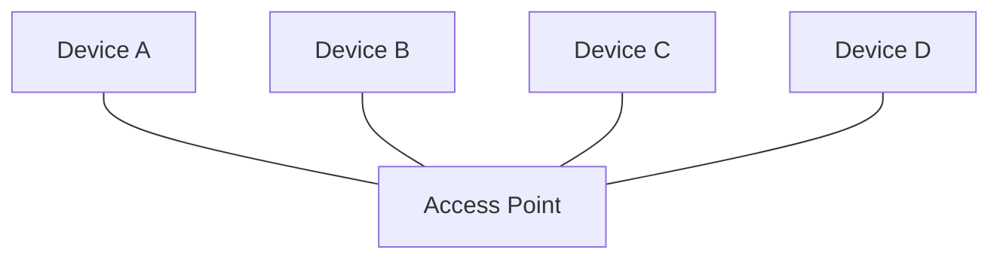
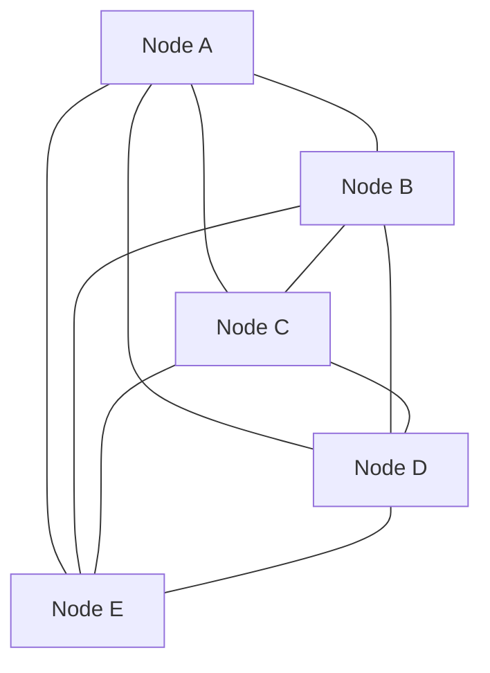

# Mesh Networking Overview

Mesh networking allows devices to communicate with each other directly without relying on centralized infrastructure.

Instead of connecting to a single access point, each node participates in forwarding traffic across the network.

This allows networks to extend coverage beyond the range of a single device.

---

## Key Characteristics

Mesh networks typically exhibit the following properties:

* decentralized topology
* dynamic routing
* resilience to node failure
* extended range through relaying

Because nodes relay traffic for each other, the network can continue operating even if individual devices fail.

---

## Relevance to Team Tracking

For small distributed teams operating without existing infrastructure, mesh networking offers several advantages:

* no reliance on cellular networks
* flexible deployment
* extended communication range

These characteristics make mesh networking a promising architecture for distributed situational awareness systems.

---

# Mesh vs Star Networks

Traditional wireless networks often use a **star topology**.

In a star network, all devices connect to a **central access point**.
Communication flows through that central device.

### Star Network Topology

If the central node fails, communication between all devices stops.

---

### Mesh Network Topology

In a mesh network, devices connect **directly to multiple peers** and may relay traffic for one another.

Because nodes are interconnected, the network can continue functioning even if individual nodes drop offline.

---

### Key Differences

| Feature                | Star Network            | Mesh Network               |
| ---------------------- | ----------------------- | -------------------------- |
| Central Infrastructure | Required                | Not required               |
| Failure Impact         | Single point of failure | Multiple redundant paths   |
| Range Extension        | Limited to AP coverage  | Can extend via relay nodes |
| Complexity             | Low                     | Higher routing complexity  |

For distributed field networks, mesh architectures often provide greater resilience and flexibility than traditional star-based networks.
