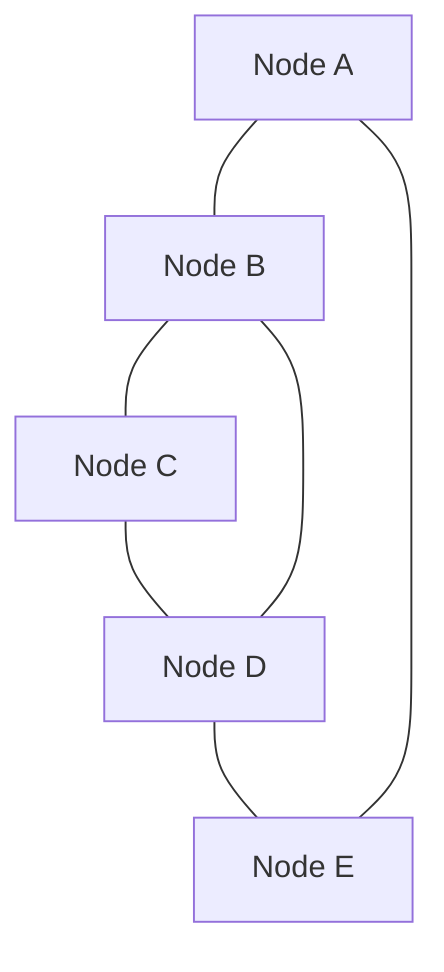

# Mesh Network Topology

```mermaid
graph TD

A[Node A]
B[Node B]
C[Node C]
D[Node D]
E[Node E]

A --- B
B --- C
C --- D
B --- D
D --- E
A --- E
```

In a mesh network, each node may connect to multiple peers.

If one path fails, traffic can be routed through alternative nodes.
