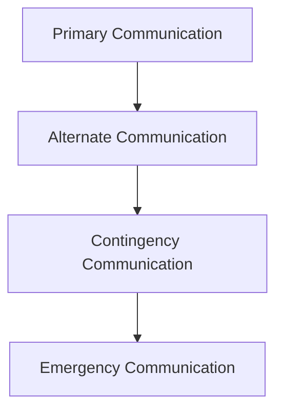

# PACE Communication Model

The PACE framework organizes communication systems into redundant layers.

Example implementation:

*Primary → IP mesh network
*Alternate → secondary radio channel
*Contingency → LoRa messaging
*Emergency → voice or visual signals
